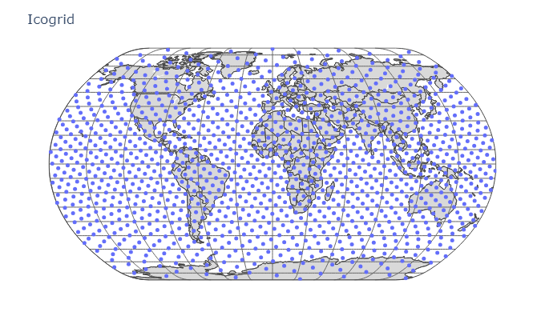
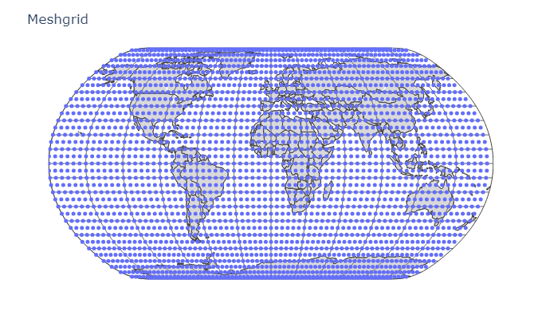
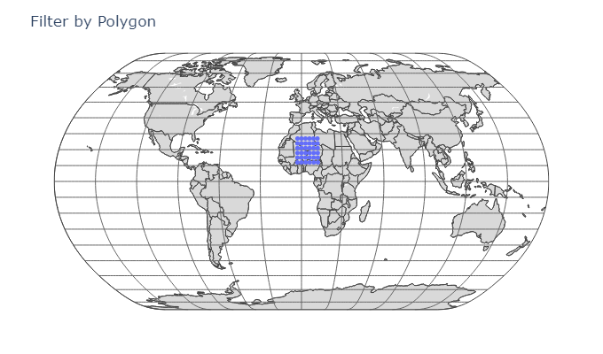
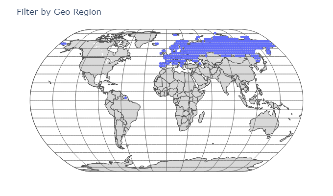

# GeoGrids.jl

This is a package containing functions for Geographical Grids generation for example for terminals distribution for System Level Simulations. **In the next version support for Geo Surface tesselation for cell grid layout will be supported**.

## Exported Functions

### Icogrid

    icogrid(;N=nothing, sepAng=nothing, unit=:rad, height=nothing, type=:lla)

This function returns a `Vector` of `Point2` or `LLA` elements, for a `N` points Global grid built with the **Fibonacci Spiral** method.

The grid can be generated starting fom the number of point requested on the grid (`N`) or by the minimum separation angle requested for the points (`sepAng`).

The problem of how to evenly distribute points on a sphere has a very long history. Unfortunately, except for a small handful of cases, it still has not been exactly solved. Therefore, in nearly all situations, we can merely hope to find near-optimal solutions to this problem.

Of these near-optimal solutions, one of the most common simple methods is one based on the **Fibonacci lattice** or **Golden Spiral** or **Fibonacci Spiral**. Furthermore, unlike many of the other iterative or randomised methods such a simulated annealing, the Fibonacci spiral is one of the few direct construction methods that works for arbitrary `N`.

This method of points distribution is **Area Preserving** but not distance preserving.

When the selected output type is `Point2`, as convention it has been considered: `LAT=x`, `LON=y` and the output can be returned either in `:deg` or `:rad` units.

  

---

### Meshgrid

	rectgrid(xRes::ValidAngle; yRes::ValidAngle=xRes, height=nothing, unit=:rad, type=:lla)

This function returns a `Matrix` of `Point2` or `LLA` elements representing a 2D Global grid of coordinates with the specified resolutions `xRes` and `yRes` respectively for x and y axes. This function return the `LAT`, `LON` meshgrid similar to the namesake MATLAB function.

When the selected output type is `Point2`, as convention it has been considered: `LAT=x`, `LON=y` and the output can be returned either in `:deg` or `:rad` units.

  

---

### Filtering

    in_region(p::Union{LLA, Point2, AbstractVector, Tuple}, domain::Union{GeometrySet, PolyArea}) -> Bool
    in_region(p::Union{LLA, Point2, AbstractVector, Tuple}, domain::Union{GeoRegion, PolyRegion}) -> Bool
    in_region(points::Array{<:Union{LLA, Point2, AbstractVector, Tuple}}, domain::Union{GeometrySet, PolyArea}) -> Array{Bool}
    in_region(points::Array{<:Union{LLA, Point2, AbstractVector, Tuple}}, domain::Union{GeoRegion, PolyRegion}) -> Array{Bool}

This function determines if a given point belongs to a 2-dimensional `Meshes.Domain` object. The `Meshes.Domain` object represents a geometric domain, which is essentially a 2D region in space, specified by its bounds and discretization. 

The function first converts the input tuple into a `Point` object, which is then checked if it falls inside the given `Meshes.Domain` object.
The `Meshes.Domain` can be either a `GeometrySet` or a `PolyArea` object.

---

    filter_points(points::Union{Vector{LLA}, Vector{AbstractVector}, Vector{Point2}, Vector{Tuple}}, domain::Union{GeometrySet, PolyArea}) -> Vector{Input Type}
    filter_points(points::Union{Vector{LLA}, Vector{AbstractVector}, Vector{Point2}, Vector{Tuple}}, domain::Union{GeoRegion, PolyRegion}) -> Vector{Input Type}
    
Returns the list of of points based on whether they fall within a specified geographical domain.

  

  

---

    extract_countries(r::GeoRegion)

Extracts the countries from a given region. The output represents the field `domain` of `GeoRegion`.

It first gets the field names of the `GeoRegion` type, excluding the `:name`, then maps these field names to their corresponding values in the `GeoRegion` instance `r`, creating a collection of pairs. It filters out any pairs where the value is empty. It converts this collection of pairs into a `NamedTuple`, finally, it calls `GeoGrids.extract_countries` with the `NamedTuple` as keyword arguments.

This function is an overload of `GeoGrids.extract_countries` that takes a `GeoRegion` object as input. It extracts the countries from the given region and returns them.    

---

## Useful Internal Functions

    _meshgrid(xin,yin)

Create a 2D grid of coordinates using the input vectors `xin` and `yin`.
The output, in the form of `SVector(xout,yout)`, contains all possible combinations of the elements of `xin` and `yin`, with `xout` corresponding to the horizontal coordinates and `yout` corresponding to the vertical coordinates.

---

    _icogrid(N::Int; coord::Symbol=:sphe, spheRadius=1.0)	

This is the base function used by `icogrid`. This function generates `N` uniformly distributed points on the surface of a unitary sphere using the classic Fibonacci Spiral.

The output can be returned as a `SVector` of either, spherical or cartesian coordinates.

---

	plot_geo_points(points; title="Point Position GEO Map", camera::Symbol=:twodim, kwargs_scatter=(;), kwargs_layout=(;))

This function takes an `Array` of `Union{Point2,LLA,AbstractVector,Tuple}` of LAT-LON coordinates and generates a plot on a world map projection using the PlotlyJS package.

The input is checked and the angles converted in deg if passed as `Unitful` and interpreted as rad if passed as `Real` values.
