# GeoGrids.jl

[](https://mcontim.github.io/GeoGrids.jl/stable)
[](https://mcontim.github.io/GeoGrids.jl/dev)
[](https://github.com/mcontim/GeoGrids.jl/actions/workflows/CI.yml?query=branch%3Amain)
[](https://codecov.io/gh/mcontim/GeoGrids.jl)
[](https://github.com/JuliaTesting/Aqua.jl)
[](https://github.com/aviatesk/JET.jl)

This is a package containing functions for Geographical Grids generation, for example for terminals distribution for System Level Simulations.

## v0.5.0 - Updates

- Support for different type of regions.
- Tessellation for creating cell grid layouts is supported on this version.
- Faster computation of filtering and grouping of points in different regions.
- Offsetting of regions is supported on this version.

## Basic Types

- `AbstractRegion`: Abstract type representing a geographical region.
  - `GlobalRegion`: Represents the entire globe.
  - `LatBeltRegion`: Represents a latitude belt defined by minimum and maximum latitudes.
  - `GeoRegion`: Represents a geographical region defined by a country or a list of countries.
  - `PolyRegion`: Represents a region defined by a polygon of latitude-longitude coordinates.

- `AbstractTiling`: Abstract type for different tessellation methods.
  - `HEX`: Hexagonal tessellation with specified direction (`:pointy` or `:flat`).
  - `ICO`: Icosahedral grid tessellation with specified correction factor and pattern (`:hex` or `:circle`).
  - `H3`: Uber's H3 hexagonal hierarchical geospatial indexing system (not implemented in current version).

### Enlarged Regions

- `GeoRegionOffset`: Represents a geographical region defined by a country or a list of countries, with an additional field `:enlarged` that can be set to `true` to indicate that the region is enlarged.
- `PolyRegionOffset`: Represents a region defined by a polygon of latitude-longitude coordinates, with an additional field `:enlarged` that can be set to `true` to indicate that the region is enlarged.
  
These types provide a flexible framework for defining geographical regions and tessellation methods for creating grid layouts in GeoGrids.jl. They allow users to specify different types of regions (global, latitude belts, country-based, or custom polygons) and choose appropriate tessellation methods for their specific needs.


## Icosahedral Grid

    icogrid(; N::Union{Int,Nothing}=nothing, sepAng::Union{ValidAngle,Nothing}=nothing) -> Vector{Point{🌐,<:LatLon{WGS84Latest}}}

At least one of `N`, the number of points to generate, or `sepAng`, the separation angle between points, must be provided.

This function returns a `Vector` of `Point{🌐,<:LatLon{WGS84Latest}}` elements, representing a global grid built with an icosahedral-based method.

The grid is generated based on the specified `radius` and `type` parameters. The `type` parameter is an `ICO` struct that defines the correction factor and pattern (hexagonal or circular) for the grid.

The problem of how to evenly distribute points on a sphere has a very long history. Unfortunately, except for a small handful of cases, it still has not been exactly solved. Therefore, in nearly all situations, we can merely hope to find near-optimal solutions to this problem.

Of these near-optimal solutions, the icosahedral grid is one approach that provides a more uniform distribution of points on a sphere compared to simple latitude-longitude grids. It starts with a regular icosahedron inscribed in a sphere and then subdivides its faces to create a finer mesh.

This method of point distribution aims to provide a more uniform coverage of the Earth's surface, which can be particularly useful for global-scale simulations or analyses.

The function returns points in the WGS84 coordinate system, represented as latitude-longitude pairs.

### Example:

```julia
	plot_geo_points(icogrid(sepAng=5); title="Ico Grid")
```

<p align="center">
  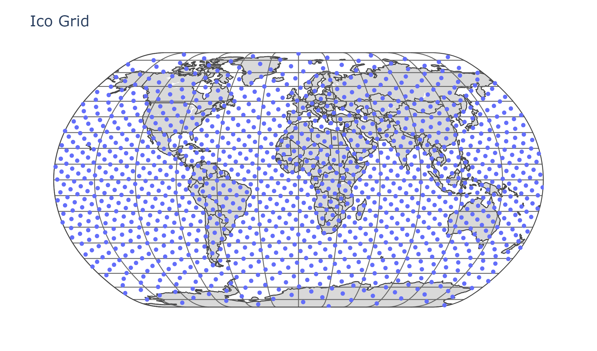
</p>

## Rectangular Grid

    rectgrid(xRes::ValidAngle; yRes::ValidAngle=xRes) -> Array{Point{🌐,<:LatLon{WGS84Latest}}, 2}

This function generates a rectangular grid of points on the Earth's surface. It returns a `Matrix` of `Point{🌐,<:LatLon{WGS84Latest}}` elements, representing a global grid with the specified parameters.

At least `xRes` must be provided, which is the resolution for the latitude grid spacing.

The function generates a grid of regularly spaced points on the Earth's surface.
The grid points are returned as `Point{🌐,<:LatLon{WGS84Latest}}` objects, representing latitude-longitude coordinates in the WGS84 coordinate system.

This rectangular grid can be useful for various geospatial applications, such as creating evenly spaced sampling points across the globe or defining a regular grid for data analysis and visualization.

### Example:

```julia
	plot_geo_points(rectgrid(5)[:]; title="Rect Grid")
```

<p align="center">
  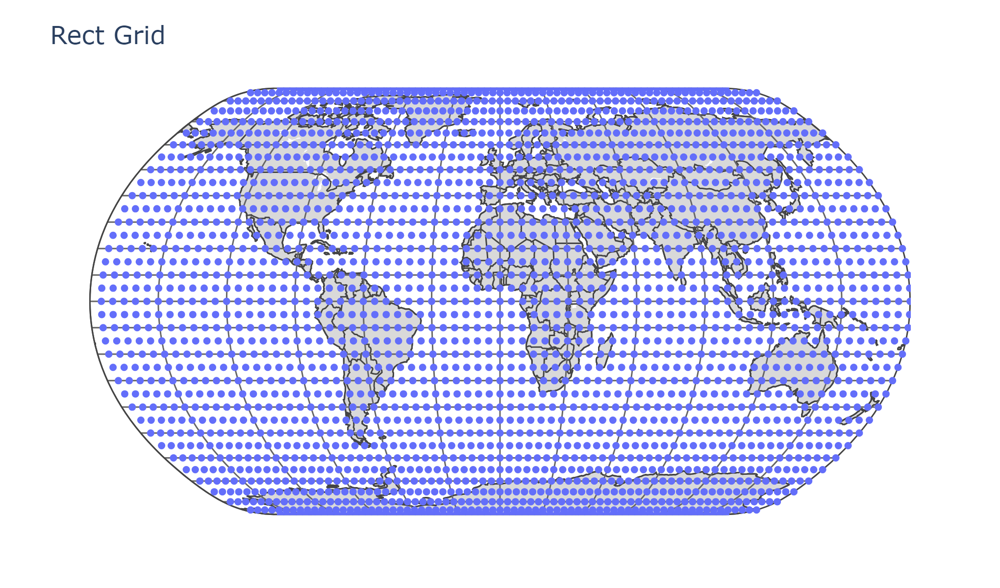
</p>

## Vector Grid

    vecgrid(gridRes::ValidAngle) -> Vector{Point{🌐,<:LatLon{WGS84Latest}}}

This function generates a vector of latitude points from the equator to the North Pole with a specified resolution. It returns a `Vector` of `Point{🌐,<:LatLon{WGS84Latest}}` elements, representing a grid of latitudes with the specified resolution.

The `gridRes` parameter must be provided, which is the resolution for the latitude grid spacing. This can be a real number (interpreted as degrees) or a `ValidAngle`.

The function generates a vector of latitude points ranging from 0° (the equator) to 90° (the North Pole). Each point is represented as a `Point{🌐,<:LatLon{WGS84Latest}}` object with a fixed longitude of 0°.

This vector grid can be useful for various applications that require sampling or analysis along a meridian, such as studying latitudinal variations in climate data, or creating a basis for more complex grid structures.

## Filtering

    in(p::Union{LatLon, Point{🌐,<:LatLon{WGS84Latest}}}, domain::AbstractRegion) -> Bool
    in(points::AbstractVector{<:Union{LatLon, Point{🌐,<:LatLon{WGS84Latest}}}}, domain::AbstractRegion) -> Vector{Bool}

This function determines if a given point or vector of points belongs to an `AbstractRegion`. The `AbstractRegion` can be a `GlobalRegion`, `GeoRegion`, `GeoRegionOffset`, `PolyRegion`, or `LatBeltRegion`.

For a single point, the function returns a boolean indicating whether the point is inside the region.
For a vector of points, it returns a vector of booleans, each indicating whether the corresponding point is inside the region.

The function checks if each point falls inside the given region using the appropriate method for that region type.

    filter_points(points::AbstractVector{<:Union{LatLon, Point{🌐,<:LatLon{WGS84Latest}}}}, domain::AbstractRegion) -> Vector{eltype(points)}

This function filters a vector of points based on whether they fall within a specified region. It returns a new vector containing only the points that are inside the region.

    filter_points_fast(points::AbstractVector{<:Union{LatLon, Point{🌐,<:LatLon{WGS84Latest}}}}, domain::AbstractRegion) -> Vector{eltype(points)}

This is a faster version of `filter_points` that uses a different algorithm for checking point inclusion. It's particularly efficient for large numbers of points.

    group_by_domain(points::AbstractVector{<:Union{LatLon, Point{🌐,<:LatLon{WGS84Latest}}}}, domains::AbstractVector{<:AbstractRegion}) -> Dictionary{String, Vector{eltype(points)}}

This function groups points based on which region they belong to. It returns a dictionary where the keys are names of the domains, and the values are vectors of points that fall within each domain.

    group_by_domain_fast(points::AbstractVector{<:Union{LatLon, Point{🌐,<:LatLon{WGS84Latest}}}}, domains::AbstractVector{<:AbstractRegion}) -> Dictionary{String, Vector{eltype(points)}}

This is a faster version of `group_by_domain` that uses the same efficient algorithm as `filter_points_fast`.

### Examples:

```julia
  p = icogrid(;sepAng=1)
  r = GeoRegion(;admin="Italy;Spain")
  f = filter_points(p,r)
  plot_geo_points(f; title="Geo Region Filtering")
```

<p align="center">
  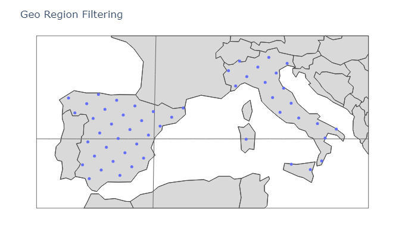
</p>

```julia
  p = icogrid(;sepAng=4)
  r = LatBeltRegion(;lim=(-10,10))
  f = filter_points(p,r)
  plot_geo_points(f; title="Lat Belt Region Filtering")
```

<p align="center">
  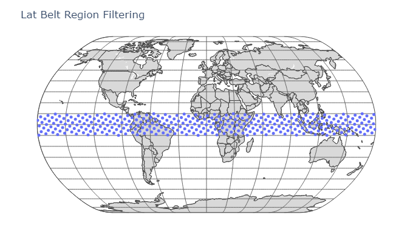
</p>

```julia
  p = rectgrid(2)
  r = PolyRegion(domain=[LatLon(10°, -5°), LatLon(10°, 15°), LatLon(27°, 15°), LatLon(27°, -5°)])
  f = filter_points(p[:],r)
  plot_geo_points(f; title="Poly Region Filtering")
```

<p align="center">
  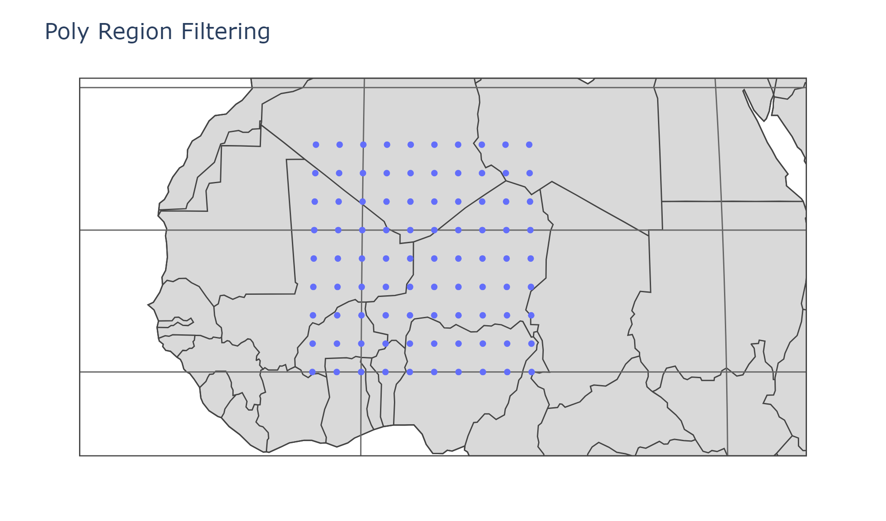$s$
</p>

## Tessellation

    generate_tesselation(region::Union{GeoRegion, PolyRegion}, radius::Number, type::HEX; refRadius::Number=constants.Re_mean, kwargs_lattice...) -> AbstractVector{<:Point{🌐,<:LatLon{WGS84Latest}}}
    generate_tesselation(region::Union{GeoRegion, PolyRegion}, radius::Number, type::HEX, ::EO; refRadius::Number=constants.Re_mean, kwargs_lattice...) -> AbstractVector{<:Point{🌐,<:LatLon{WGS84Latest}}}, AbstractVector{<:AbstractVector{<:Point{🌐,<:LatLon{WGS84Latest}}}}
    generate_tesselation(region::GlobalRegion, radius::Number, type::ICO; refRadius::Number=constants.Re_mean) -> AbstractVector{<:LatLon}
    generate_tesselation(region::GlobalRegion, radius::Number, type::ICO, ::EO; refRadius::Number=constants.Re_mean) -> AbstractVector{<:LatLon}, AbstractVector{<:AbstractVector{<:LatLon}}
    generate_tesselation(region::Union{LatBeltRegion, GeoRegion, PolyRegion}, radius::Number, type::ICO; refRadius::Number=constants.Re_mean) -> AbstractVector{<:LatLon}
    generate_tesselation(region::Union{LatBeltRegion, GeoRegion, PolyRegion}, radius::Number, type::ICO, ::EO; refRadius::Number=constants.Re_mean) -> AbstractVector{<:LatLon}, AbstractVector{<:AbstractVector{<:LatLon}}

This function generates a tessellation pattern around a given center point. It creates a geometric arrangement of points based on the specified pattern type and parameters. The function takes a center point, a radius (in meters), and a pattern type as its main arguments. The pattern can be either hexagonal (`:hex`) or circular (`:circle`).

The function returns a vector of `Point{🌐,<:LatLon{WGS84Latest}}` objects, representing the centers of each of the tiles. When called with the `EO` argument, it additionally returns a vector of vectors containing the indices of points representing the contour of each of the tiles.

This function can be particularly useful for generating tessellations for cell layouts in various applications. It provides a flexible way to create regular point patterns on a spherical surface, which can be beneficial in fields such as telecommunications for planning cell tower placements, environmental studies for creating sampling grids, or in any geospatial analysis requiring a structured arrangement of points.

### Examples:

```julia
  r = GlobalRegion()
  c,t = generate_tesselation(r, 700e3, ICO(), EO())
  plot_geo_cells(c,t;title="Global Region cell layout")
```

<p align="center">
  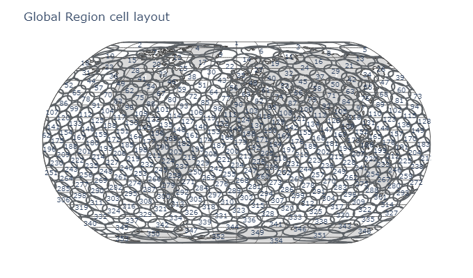
</p>

```julia 
  r = GeoRegion(;admin="Italy;Spain")
  c,t = generate_tesselation(r, 50e3, HEX(), EO())
  plot_geo_cells(c,t;title="Geo Region cell layout")
```

<p align="center">
  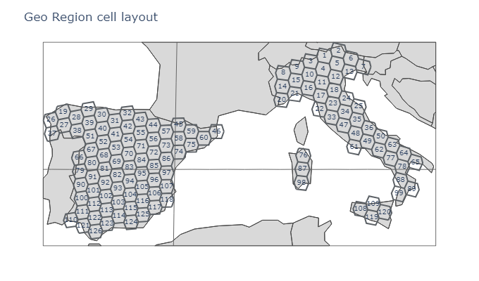
</p>

```julia 
  r = LatBeltRegion(;lim=(-10,10))
  c,t = generate_tesselation(r, 500e3, ICO(), EO())
  plot_geo_cells(c,t;title="Lat Belt Region cell layout")
```

<p align="center">
  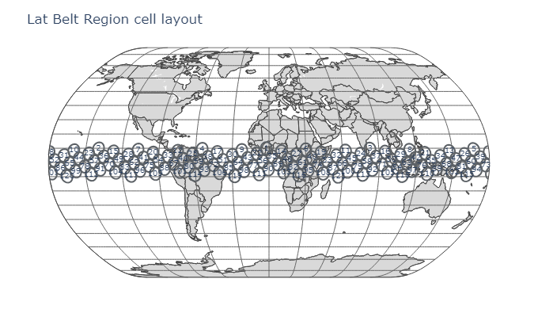
</p>

```julia 
  r = PolyRegion(domain=[LatLon(10°, -5°), LatLon(10°, 15°), LatLon(27°, 15°), LatLon(27°, -5°)])
  c,t = generate_tesselation(r, 100e3, HEX(), EO())
  plot_geo_cells(c,t;title="Poly Region cell layout")
```

<p align="center">
  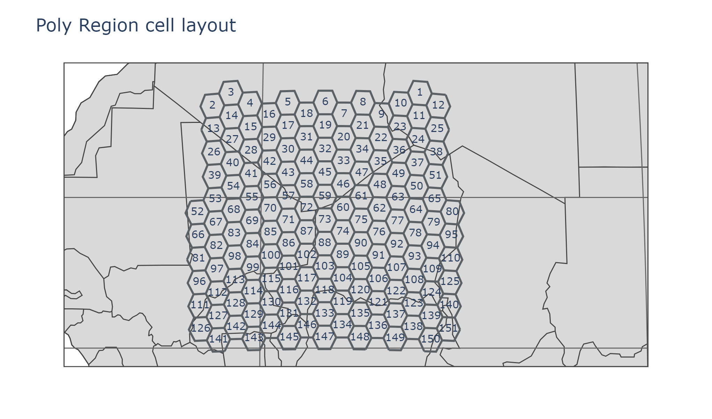
</p>

## Region Enlargement and Offsetting

GeoGrids.jl provides functionality to enlarge or offset regions, which can be useful for various applications such as creating buffer zones or expanding coverage areas.

    offset_region(originalRegion::Union{GeoRegion, PolyRegion}, deltaDist; refRadius=constants.Re_mean, magnitude=3, precision=7)

This function takes an original region (either a `GeoRegion` or a `PolyRegion`) and offsets it by a specified distance. The offset can be positive (to enlarge the region) or negative (to shrink it).

As default usage you should use directly the `GeoRegionOffset` and `PolyRegionOffset` types.

```julia
  # Enlarge the selected GEO region by 50km
  ereg = GeoRegionOffset(delta=50e3, admin="Spain; Italy", resolution=110)
  plot_geo_poly(ereg.domain; title="Geo Region Enlarged")
```	

<p align="center">
  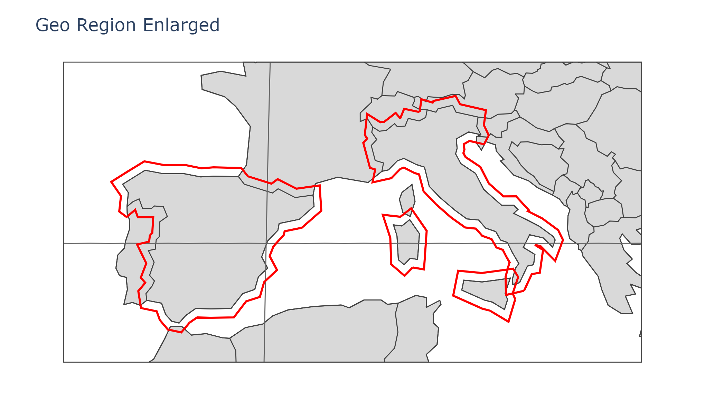
</p>

```julia
  # Enlarge the selected POLY region by 100km
  epoly = PolyRegionOffset(delta=100e3, domain=[LatLon(10°, -5°), LatLon(10°, 15°), LatLon(27°, 15°), LatLon(27°, -5°)])
  plot_geo_poly([epoly.domain.latlon.geoms..., epoly.original.domain.latlon]; title="Normal and Enlarged PolyRegion")
```	

<p align="center">
  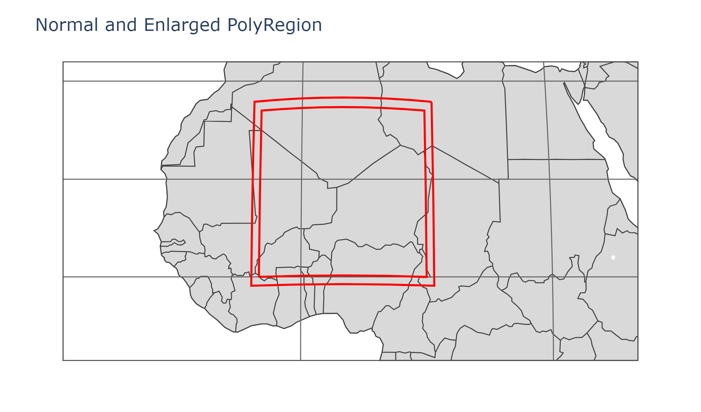
</p>

## Useful Additional Functions

	  plot_geo_points(points; title="Point Position GEO Map", camera::Symbol=:twodim, kwargs_scatter=(;), kwargs_layout=(;))

This function takes an `Array` of `Union{Point{🌐,<:LatLon{WGS84Latest}},LatLon,AbstractVector,Tuple}` of LAT-LON coordinates and generates a plot on a world map projection using the PlotlyJS package.

The input is checked and the angles converted to degrees if passed as `Unitful` and interpreted as degrees if passed as `Real` values.

	  plot_geo_cells(centers, tessellation; title="Cell Layout GEO Map", camera::Symbol=:twodim, kwargs_scatter=(;), kwargs_layout=(;))

This function takes an `Array` of cell centers and a corresponding tessellation, and generates a plot of the cell layout on a world map projection using the PlotlyJS package.

	  plot_geo_poly(poly::AbstractRegion; title="Polygon GEO Map", camera::Symbol=:twodim, kwargs_scatter=(;), kwargs_layout=(;))

This function takes an `AbstractRegion` (which can be a `PolyRegion`, `GeoRegion`, or other types that inherit from `AbstractRegion`) and generates a plot of the region's boundaries on a world map projection using the PlotlyJS package.

    plot_unitarysphere(points; title="Points on Unitary Sphere", camera::Symbol=:threedim, kwargs_scatter=(;), kwargs_layout=(;))

This function takes an `Array` of 3D Cartesian coordinates and generates a plot of these points on a unitary sphere using the PlotlyJS package.

For all these functions:
- `camera` can be set to `:twodim` for a 2D view or `:threedim` for a 3D view.
- `kwargs_scatter` and `kwargs_layout` allow you to pass additional keyword arguments to customize the scatter plot and layout respectively.
